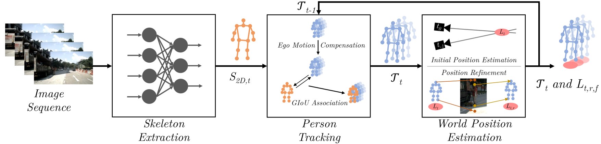

# Pedestrian Environment Model for Automated Driving


**[Pedestrian Environment Model for Automated Driving](https://arxiv.org/abs/2308.09080)**<br />
This is the official project page of our paper.<br />
Adrian Holzbock, Alexander Tsaregorodtsev, and Vasileios Belagiannis<br />
Accepted at the 26th IEEE International Conference on Intelligent Transportation Systems ITSC 2023, September 24-28 2023, Bilbao, Spain<br />

<br />

<div align="center">

</div>

<br />


## Directory Structure

```shell
│
└───data
│   └───simulated_dataset
│   └───v1.0-mini
└───simulation
│   └───output
|   |main.py
|   |...
│README.md
|CID_state_dict.pth
|main.py
│...
```


## Requirements

### Build Environment for the Pedestrian Environment Model
We added a [Dockerfile](./Dockerfile) for an easy execution of our code. To run the docker do the following steps:
1. To build the docker container, navigate to the main directory and execute `docker build -t pedenv:latest .`.
2. You can run the container by executing `run_docker.sh`.
3. In the container, navigate to `/workspace/` to run a script.

### Build Environment for Simulate Data
New synthetic data can be generated with the CARLA simulator. We provide the code and a docker environment in the [simulation directory](./simulation). Execute the following scripts and commands in the simulation directory.
1. Run [run_carla_server.sh](./simulation/run_carla_server.sh) to pull and start the CARLA server.
2. Build the docker container with `docker build -t carla:latest .`.
3. Execute [run_docker.sh](./simulation/run_docker.sh) to start the environment.
4. Navigate to `/workspace/` to run a script.

## Datasets
Download the nuScenes mini-set-split from the official [nuScenes](https://www.nuscenes.org/nuscenes) homepage and place it in the data directory. The simulated data used in the paper's evaluation can be downloaded from [Google Drive](https://drive.google.com/drive/folders/1Oyqi8XOp_XHbtsCHOj0npqzoKOCugvst?usp=sharing) and should be placed beside the nuScenes dataset in the data directory.

## Pre-Trained Model Parameters
The pre-trained parameters for the CID human pose estimation network can be downloaded from the official mmPose documentation website. Rename the parameters to `CID_state_dict.pth` and place them in the main directory. [Download parameters](https://download.openmmlab.com/mmpose/v1/body_2d_keypoint/cid/coco/cid_hrnet-w32_8xb20-140e_coco-512x512_42b7e6e6-20230207.pth)

## Exectute the Code
The evaluation can be done by starting [`main.py`](./main.py), located in the main directory. To evaluate the nuScenes dataset, use `python3 main.py --data nuscenes`, and for the simulated dataset, use `python3 main.py --data simulated`. After the evaluation is finished, the results are displayed in the shell. 

In case new data should be simulated, the [main file](./simulation/main.py) in the simulation directory can be started. The new scenes are saved in the `output` folder, which has to be created before in the `simulation` directory.

## Citation
If you use our Pedestrian Environment Model in your work or refer to our results in your paper, please cite the following work:
```latex
@article{holzbock2023pedestrian,
  title={Pedestrian Environment Model for Automated Driving},
  author={Holzbock, Adrian and Tsaregorodtsev, Alexander and Belagiannis, Vasileios},
  journal={arXiv preprint arXiv:2308.09080},
  year={2023}
}
```